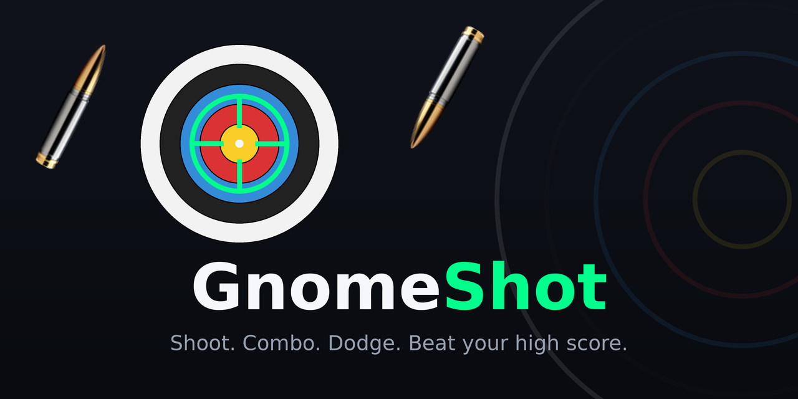
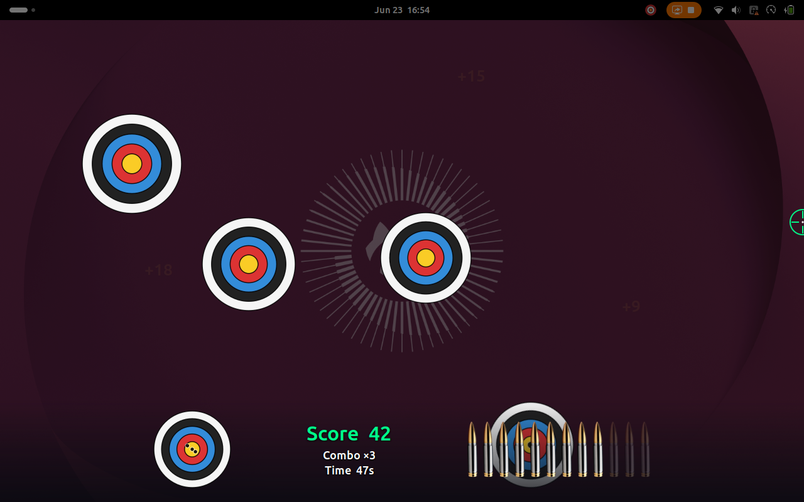
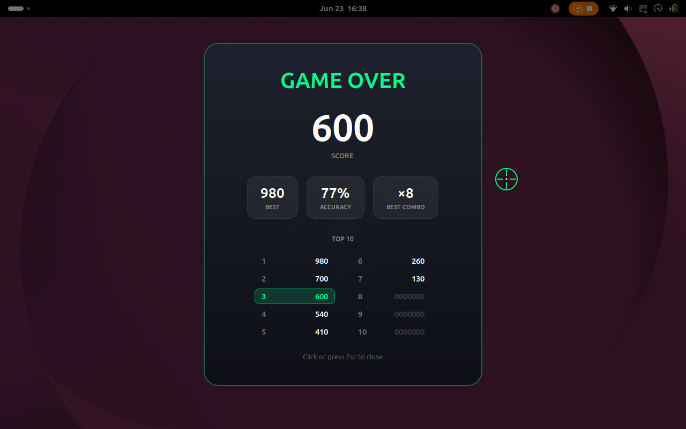

<p align="center">
  
</p>

<p align="center">
  <b>A fullscreen aim-trainer shooting game that lives in your GNOME Shell panel.</b><br>
  Click the target icon, hunt down archery targets before they slip away, build combos, and climb the leaderboard.
</p>

<p align="center">
  
  
</p>

---

## Gameplay

<p align="center">
  
  
</p>

A 60-second round drops a full-screen overlay over your desktop. Archery targets pop in and immediately start receding into the distance — shoot them before they shrink away. Where your shot lands on the rings decides the points (bullseye = 10, outer edge = 1), multiplied by your current combo. Miss, or let one escape, and the combo resets.

## Features

- 🎯 **Placement scoring** — gold bullseye to outer ring, with a rising **combo multiplier**.
- 🔫 **12-round magazine** with an on-screen bullet readout; **right-click to reload** (reload time scales with the rounds you actually used). Dry-fire click when you're empty.
- 💥 **Juicy feedback** — pistol recoil on the crosshair, a flame burst at the point of impact, bullet holes punched into the target, and a gravity-driven tumble off the bottom of the screen on a hit.
- 🏃 **Dodging targets** — some targets dart sideways with real momentum (they accelerate and have to brake before reversing), so you have to track them.
- 🔊 **Sound** — gunshot, reload, dry-fire, and a "nice shot" voice line on a dead-centre bullseye.
- 📊 **Bottom HUD zone** — score, combo, time, a live **hit-grouping target** showing where all your shots landed, and the ammo bar.
- 🏆 **Persistent Top-10 leaderboard** — no names, just scores; your run is highlighted if it makes the board.

## How to play

| Action | Control |
| --- | --- |
| Aim | Move the mouse (the crosshair *is* your pointer) |
| Shoot | **Left-click** |
| Reload | **Right-click** (or middle-click) |
| Quit / dismiss Game Over | **Esc** (or click) |

Open and close the game from the **🎯 target icon** in the top panel.

## Install

GnomeShot is a standard GNOME Shell extension (modern ESM style, GNOME Shell **48–50**).

```sh
git clone git@github.com:vanvonvan/GnomeShot.git \
  ~/.local/share/gnome-shell/extensions/gnomeshot@vanvonvan.github.io
gnome-extensions enable gnomeshot@vanvonvan.github.io
```

Then restart GNOME Shell so it picks up the new extension:

- **Xorg:** `Alt`+`F2`, type `r`, `Enter`.
- **Wayland:** log out and back in (the Shell can't hot-reload under Wayland).

> Tip for hacking on it locally: test in an isolated nested session with
> `dbus-run-session -- gnome-shell --nested --wayland` (or `--devkit`) so you don't disturb your real desktop.

## Credits

- **Built by [Claude](https://claude.com/claude-code)** (Anthropic's Claude Code, Opus model) — the entire extension, from gameplay and game feel to the artwork, branding, and this README, was designed and implemented by Claude in collaboration with the repo owner.
- **Sound effects** — sourced from [Pixabay](https://pixabay.com/sound-effects/) (royalty-free, no attribution required): gunshot, 1911 reload, dry-fire, and the "awesome" voice line.
- **Bullet artwork** — bundled under `assets/`.
- Built with **GJS** on **GNOME Shell**, drawn with **St** + **Cairo**.

## License

Released under the **GNU GPL v2.0 or later**, the standard for GNOME Shell extensions.
